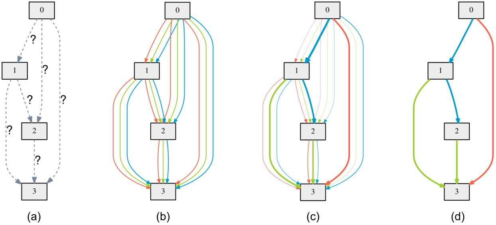

# Committee of NAS-based models
Code accompanying the paper
> [DARTS: Differentiable Architecture Search](https://arxiv.org/abs/1806.09055)\
> Hanxiao Liu, Karen Simonyan, Yiming Yang.\
> _arXiv:1806.09055_.

<p align="center">
  
</p>
The algorithm is based on continuous relaxation and gradient descent in the architecture space. It is able to efficiently design high-performance convolutional architectures for image classification (on CIFAR-10 and ImageNet) and recurrent architectures for language modeling (on Penn Treebank and WikiText-2). Only a single GPU is required.

## Requirements
```
Python >= 3.5.5, PyTorch == 0.3.1, torchvision == 0.2.0
```
NOTE: PyTorch 0.4 is not supported at this moment and would lead to OOM.

## Datasets
Instructions for acquiring PTB and WT2 can be found [here](https://github.com/salesforce/awd-lstm-lm). While CIFAR-10 can be automatically downloaded by torchvision, ImageNet needs to be manually downloaded (preferably to a SSD) following the instructions [here](https://github.com/pytorch/examples/tree/master/imagenet).

## Pretrained models
The easist way to get started is to evaluate our pretrained DARTS models.

**CIFAR-10** ([cifar10_model.pt](https://drive.google.com/file/d/1Y13i4zKGKgjtWBdC0HWLavjO7wvEiGOc/view?usp=sharing))
```
cd cnn && python test.py --auxiliary --model_path cifar10_model.pt
```
* Expected result: 2.63% test error rate with 3.3M model params.

**PTB** ([ptb_model.pt](https://drive.google.com/file/d/1Mt_o6fZOlG-VDF3Q5ModgnAJ9W6f_av2/view?usp=sharing))
```
cd rnn && python test.py --model_path ptb_model.pt
```
* Expected result: 55.68 test perplexity with 23M model params.

**ImageNet** ([imagenet_model.pt](https://drive.google.com/file/d/1AKr6Y_PoYj7j0Upggyzc26W0RVdg4CVX/view?usp=sharing))
```
cd cnn && python test_imagenet.py --auxiliary --model_path imagenet_model.pt
```
* Expected result: 26.7% top-1 error and 8.7% top-5 error with 4.7M model params.

## Architecture search (using small proxy models)
To carry out architecture search using 2nd-order approximation, run
```
cd cnn_space1 && python train_search.py      # for conv cells on CIFAR-10
cd cnn_space2 && python train_search.py      # for conv cells on CIFAR-10
cd cnn_space3 && python train_search.py      # for conv cells on CIFAR-10
```
## Test all models
The easist way to get started is to evaluate our DARTS models.
```
cd cnn_space1 && python test_all.py      # for conv cells on CIFAR-10
cd cnn_space2 && python test_all.py      # for conv cells on CIFAR-10
cd cnn_space3 && python test_all.py     # for conv cells on CIFAR-10
```
## To run the ensemble
```
python test_ensemble.py
```


